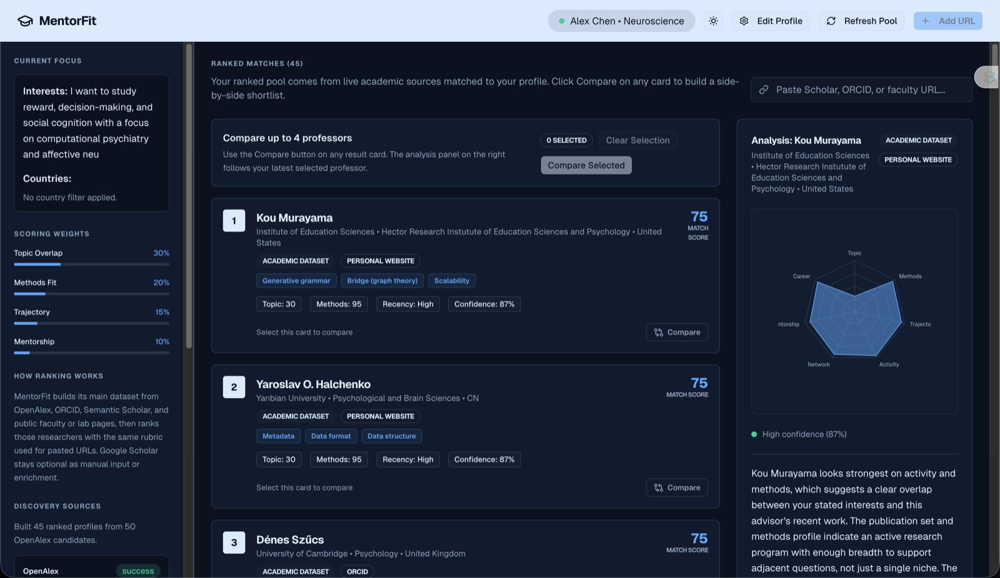
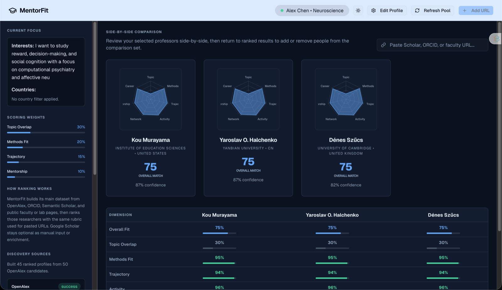
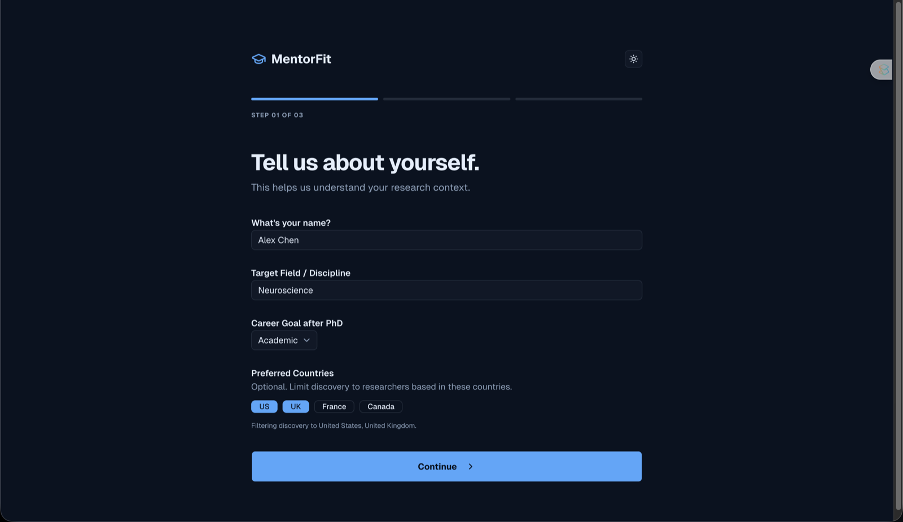
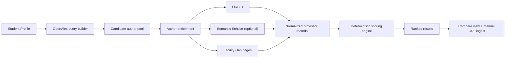

# MentorFit

<p align="center">
  <strong>Discovery-backed advisor matching for PhD applicants.</strong><br />
  MentorFit builds a live pool of researchers from public academic sources, scores them against a student profile, and lets you compare your shortlist side-by-side.
</p>

<p align="center">
  
  
  
  
  
  
</p>

<p align="center">
  <a href="#why-it-feels-different">Why It Feels Different</a> •
  <a href="#see-the-app">See The App</a> •
  <a href="#how-it-works">How It Works</a> •
  <a href="#run-it-locally">Run It Locally</a>
</p>

<p align="center">
  
</p>

## Why It Feels Different

MentorFit is not a static faculty directory and it is not a generic chatbot wrapper. It is a local-first decision-support app that helps a student answer a specific question:

**Which researchers fit my interests, methods, priorities, and target geography, and how do my hand-picked professors compare to that pool?**

### Current workflow

1. Build a student profile with field, interests, methods, career goal, weights, and optional country filters.
2. Discover researchers from OpenAlex, ORCID, Semantic Scholar enrichment, and public faculty or lab pages.
3. Rank that pool with a deterministic scoring rubric.
4. Paste your own professor URL to score a manual candidate with the same engine.
5. Compare up to four professors side-by-side.

### What is new in this version

- Live academic discovery instead of the old starter dataset
- Country filtering for `US`, `UK`, `France`, and `Canada`
- Discovery status reporting in the UI with per-source success or degraded states
- A visible compare workflow with shortlist selection and side-by-side analysis
- Server-side caching and source-specific discovery services
- OpenAlex-first institution resolution with ORCID as fallback enrichment
- A larger discovery pool cap of `50` candidate authors per run

## See The App

| Ranked discovery pool | Compare shortlisted professors |
|---|---|
|  |  |

| Profile editor with country filters |
|---|
|  |

## How It Works



### Core product surfaces

| Surface | What it does |
|---|---|
| `Onboarding` | Captures the student profile, weights, and optional country preferences |
| `Ranked Results` | Shows the live discovery pool scored against the student profile |
| `Discovery Sources` | Explains which upstream sources succeeded, degraded, or were skipped |
| `Add URL` | Ingests a professor page, ORCID page, lab page, or Scholar URL manually |
| `Compare View` | Puts up to four professors side-by-side across all score dimensions |

<details>
<summary><strong>Discovery Stack</strong></summary>

- **OpenAlex**: primary source for author identity, recent works, topics, and institution context
- **ORCID**: public identity enrichment, biography, employment metadata, and external URLs
- **Semantic Scholar**: optional enrichment when `SEMANTIC_SCHOLAR_API_KEY` is configured
- **Faculty / lab pages**: metadata previews and public-facing context

Google Scholar remains optional. It is used as a manual input or supporting URL, not as the main dataset backbone.
</details>

<details>
<summary><strong>Scoring Model</strong></summary>

MentorFit uses a deterministic heuristic scorer. It is transparent and adjustable, not an opaque learned ranking model.

Current subscores:

- Topic overlap
- Methods fit
- Trajectory
- Activity
- Network
- Mentorship proxy
- Career alignment

The overall score is a weighted average using the student's own preference sliders.
</details>

<details>
<summary><strong>Reliability Notes</strong></summary>

- Discovery is cached server-side for speed and rate-limit safety
- Institution resolution prefers OpenAlex `last_known_institutions`
- Some source signals are intentionally marked as degraded or skipped when enrichment is partial
- Mentorship and lab-culture signals are still heuristic and should be validated manually before outreach
</details>

## Project Structure

```text
MentorFit/
├── server/
│   ├── discovery.ts
│   └── services/
│       ├── cache.ts
│       ├── faculty-page.ts
│       ├── http.ts
│       ├── openalex.ts
│       ├── orcid.ts
│       └── semantic-scholar.ts
├── src/
│   ├── components/
│   ├── lib/
│   └── types.ts
└── docs/screenshots/
```

## Run It Locally

```bash
npm install
npm run dev
```

Open [http://localhost:3000](http://localhost:3000).

### Useful commands

```bash
npm run dev
npm run lint
npm run build
```

### Environment

Create a `.env` file if you want richer source coverage.

```bash
APP_URL=http://localhost:3000
OPENALEX_EMAIL=you@example.com
SEMANTIC_SCHOLAR_API_KEY=
```

Notes:

- `OPENALEX_EMAIL` is recommended so OpenAlex requests identify your client cleanly.
- `SEMANTIC_SCHOLAR_API_KEY` is optional. Without it, Semantic Scholar is skipped gracefully.

## What This Build Optimizes For

- A fast MVP loop
- Transparent ranking logic
- Local-first browser persistence
- Honest source confidence
- Better discovery before outreach

## Limitations

- This is still an MVP and not a definitive advisor recommender
- Rankings are heuristic, not predictive or benchmarked
- Some faculty and lab pages are sparse or inconsistent
- Discovery depth and latency increase with larger candidate pools

## Related Notes

- Product and architecture prompt: [docs/codex-build-prompt.md](./docs/codex-build-prompt.md)
